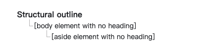

# HTML语义化实战

### 什么是HTML语义化

在编写html文件的时候，尽量使用合适的标签和属性来构建内容，从而使内容结构清晰，易于理解。同时也方便搜索引擎抓取，提升网站排名。


### 为什么需要HTML语义化

* 提高网页可读性和维护性：选用合适的标签，可以使网页结构内容更加清晰明了，易于阅读和维护。
* 增强搜索引擎优化：搜索引擎在抓取网页的过程中，让搜索引擎更好的了解网站页面结构，有利于提高网站排名。
* 提高网站的可访问性：对于使用屏幕阅读器等辅助设备的用户更加友好。
* 改善跨平台跨设备的兼容性：使网页在不同浏览器和不同设备上显示一致，减少兼容性问题。
* 提高网页加载速度：使用语义化标签可以减少冗余代码，提高页面加载速度。


### 如何使用语义标记

#### 常见语义标签

* \<header>  表示文档页眉，网站的头部。
* \<nav> 表示网站的导航链接
* \<main> 表示网站的主体部分
* \<section> 表示一个独立的区域，功能块
* \<article> 表示一个独立的内容块
* \<aside> 表示网站的侧边栏
* \<footer> 表示文档的页脚，网站的底部
* \<h1> \~ \<h6> 表示文档标题, 由大到小排列
* \<p> 表示一个段落
* \<ul> \<ol> 表示无序有序列表
* \<li> 表示列表项 包含在\<ul> \<ol>中
* \ 表示图片
* \<figure> \<figcaption> 表示一个独立的图像或多媒体

#### 语义标签实战

不加语义标签的页面

浏览器识别不了网站结构

```html
<!DOCTYPE html>
<html lang="en">
<head>
  <meta charset="UTF-8">
  <title>不加语义标签</title>
</head>
<body>
  <div class="title">标题</div>
  <div class="main">
    内容
    <div class="aside">侧边栏</div>
  </div>
  <div class="footer">底部</div>
</body>
</html>
```

.png>)

添加语义标签的页面

浏览器可以识别网站结构

```html
<!DOCTYPE html>
<html lang="en">
<head>
  <meta charset="UTF-8">
  <title>语义标签</title>
</head>
<body>
  <header class="title">标题</header>
  <main class="main">
    内容
    <aside class="aside">侧边栏</aside>
  </main>
  <footer class="footer">底部</footer>
</body>
</html>

```



